<div align="center">


<br><br>


### `AI & DATA SCIENCE` • `MACHINE LEARNING` • `COMPUTER VISION`

<samp>
Building intelligent systems • experimenting with AI • turning ideas into working projects
</samp>

<br><br>

<a href="https://github.com/Vishalchandravanshiai">

</a>
<a href="mailto:vishalchandravanshijarh@gmail.com">

</a>
<a href="www.linkedin.com/in/vishal-chandravanshii">

</a>

<br><br>


</div>

---


<samp>

I'm **Vishal Chandravanshi**, a BTech student specializing in
**Artificial Intelligence & Data Science**.

I'm interested in building practical AI systems that can actually
solve problems rather than only experimenting with models.

### 🧠 What I'm into

- 🤖 Artificial Intelligence
- 🧠 Machine Learning & Deep Learning
- 👁️ Computer Vision
- 🎙️ AI Assistants & Automation
- 🧬 Generative AI
- 🚀 AI-powered applications
- 🔬 Experimenting with new technologies

Currently learning, building, breaking, debugging and rebuilding.

</samp>

---


<div align="center">

### 🐍 Languages


<br><br>

### 🧠 AI / ML


<br><br>

### ⚙️ Development


<br><br>

### 🛠️ Tools


</div>

---


<br>

<table>
<tr>

<td width="33%" align="center">

## 🫁 PneumoVision AI

**Medical Computer Vision**

Deep-learning based chest X-ray analysis system.

**Built with**

`DenseNet121`  
`TensorFlow`  
`FastAPI`  
`Grad-CAM`

<br>

<a href="https://github.com/Vishalchandravanshiai">

</a>

</td>

<td width="33%" align="center">

## 🥔 Potato Disease Analyzer

**Computer Vision**

CNN-based potato leaf disease classification.

**Built with**

`Python`  
`TensorFlow`  
`Keras`  
`Gradio`

<br>

<a href="https://github.com/Vishalchandravanshiai">

</a>

</td>

<td width="33%" align="center">

## 🤖 AURA

**AI Desktop Assistant**

Voice-controlled assistant designed to interact
with the computer and execute tasks.

**Architecture**

`Local LLM`  
`Gemini API`  
`Speech AI`  
`Automation`

<br>

<a href="https://github.com/Vishalchandravanshiai">

</a>

</td>

</tr>
</table>

---

<div align="center">

## ⚡ GITHUB ACTIVITY


<br><br>


<br><br>



</div>

---

<div align="center">

## 🐍 CONTRIBUTION SNAKE


</div>

---

<div align="center">

## 🧊 3D CONTRIBUTION GRAPH


</div>

---

<div align="center">

## 🎯 CURRENTLY BUILDING

<table>
<tr>

<td align="center">

🤖  
**AI SYSTEMS**

</td>

<td align="center">

👁️  
**COMPUTER VISION**

</td>

<td align="center">

🧠  
**LOCAL AI**

</td>

<td align="center">

⚡  
**AUTOMATION**

</td>

</tr>
</table>

</div>

---


<div align="center">

```text
╔════════════════════════════════════════════════════╗
║                                                    ║
║        BUILD  →  BREAK  →  LEARN  →  REBUILD      ║
║                                                    ║
║              ALWAYS BUILDING SOMETHING             ║
║                                                    ║
╚════════════════════════════════════════════════════╝
